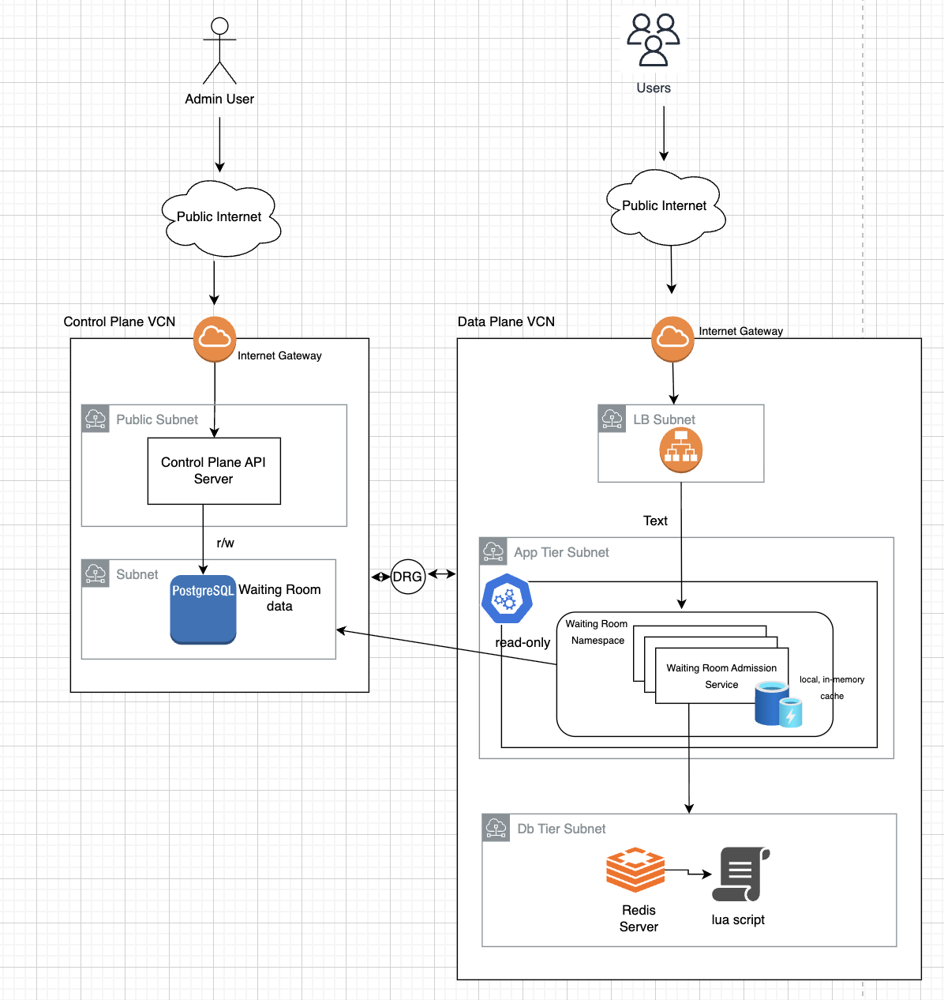

# Waiting Room

## Motivation

I was reading about Cloudflare Waiting Room and got interested in how it is designed and implemented. Cloudflare runs its product globally at the edge using Cloudflare Workers and durable storage. This project is a learning version of that idea.

The goal is to design, implement, and eventually deploy an MVP waiting room system end to end. It is intentionally simpler than Cloudflare's architecture, but it keeps the same core product problem: protect an origin application by admitting only a bounded number of active users while everyone else waits.

## Project Status

This repository currently contains an MVP for the core admission decision flow:

- Control Plane API for creating, reading, and soft-deleting waiting room configuration.
- Postgres persistence for waiting room resources.
- Data Plane admission service that serves the waiting room UI.
- Redis-backed admission decisions using a Redis Function.
- Session tracking through an HTTP-only cookie.
- Shared Go module for models and Postgres repository code used by both services.

Tests, Docker packaging, deployment, auth, and production configuration are still pending.

## Requirements

### Functional Requirements

- An admin can create a waiting room with:
  - maximum active users count
  - origin application URL
- An admin can fetch an active waiting room by room ID.
- An admin can delete a waiting room using soft delete.
- A user can visit a waiting room URL served by the admission service.
- The admission service assigns a session token cookie when one is missing.
- The admission service returns either `admit` or `wait` for a session.
- Admitted users are redirected to the configured origin application.
- Waiting users keep polling until capacity is available.

### Non-Functional Requirements

- Admission decisions must be atomic.
- The admission service should stay stateless so it can scale horizontally.
- The hot path should avoid reading Postgres on every request when possible.
- Waiting room configuration should be shared between the control plane and data plane.

## User Experience

1. An admin creates a waiting room using the Control Plane API.
2. The Control Plane stores the waiting room configuration in Postgres.
3. A user opens:

   ```text
   http://localhost:3333/waitingRooms/<roomId>
   ```

4. The Admission Service serves the embedded waiting room HTML and JavaScript.
5. The browser polls:

   ```text
   GET /waitingRooms/<roomId>/status
   ```

6. The Admission Service checks the waiting room config, invokes the Redis Function, and returns:

   ```json
   {
     "roomId": "<roomId>",
     "decision": "admit",
     "origin": "http://localhost:8080"
   }
   ```

7. If the decision is `admit`, the browser redirects to the origin application.
8. If the decision is `wait`, the browser stays on the waiting page and polls again.

## Architecture



## Repository Layout

```text
src/
  go.work
  shared/
    models/
    pg/
  controlplane/
    dao/migrations/
    routes/
    services/
  admissionservice/
    cache/
    redis/
    routes/
    scripts/
    services/
```

## Running Locally

### Prerequisites

- Go matching the version in `src/go.work`
- Docker
- Postgres
- Redis 7 or later
- golang-migrate

Install golang-migrate on macOS:

```bash
brew install golang-migrate
```

### Start Postgres

```bash
docker run -d \
  --name waitingroom-postgres \
  -p 5432:5432 \
  -e POSTGRES_USER=wr \
  -e POSTGRES_PASSWORD=wr \
  -e POSTGRES_DB=waitingroomdb \
  postgres:15
```

If the container already exists:

```bash
docker start waitingroom-postgres
```

### Start Redis

```bash
docker run -d \
  --name waitingroom-redis \
  -p 6379:6379 \
  redis:7
```

If the container already exists:

```bash
docker start waitingroom-redis
```

### Configure Postgres URL

Both services use `PG_DATABASE_URL` to connect to Postgres:

```bash
export PG_DATABASE_URL="postgres://wr:wr@localhost:5432/waitingroomdb?sslmode=disable"
```

The migration Makefile uses `PG_DATABASE_URL`. If you do not set it, the Makefile defaults to the same local database:

```bash
export PG_DATABASE_URL="postgres://wr:wr@localhost:5432/waitingroomdb?sslmode=disable"
```

### Run Migrations

```bash
cd src/controlplane
make migrate-up
```

Check migration version:

```bash
make migrate-version
```

Roll back one migration:

```bash
make migrate-down
```

### Run Control Plane

```bash
cd src/controlplane
make run
```

The Control Plane listens on:

```text
http://localhost:3000
```

### Run Control Plane With Docker

Before running the Control Plane container, make sure Postgres is running and migrations have been applied:

```bash
cd src/controlplane
make migrate-up
```

Build the Control Plane image from the `src` directory:

```bash
cd src
docker build -f controlplane/Dockerfile -t waiting-room/control-plane:0.1 .
```

Run the container:

```bash
docker run --rm \
  -p 3000:3000 \
  -e PG_DATABASE_URL="postgres://wr:wr@host.docker.internal:5432/waitingroomdb?sslmode=disable" \
  waiting-room/control-plane:0.1
```

When the Control Plane runs inside Docker, use `host.docker.internal` in `PG_DATABASE_URL` to connect to Postgres running on the host machine. Use `localhost` only when running the service directly on the host.

In another terminal, create a waiting room:

```bash
curl -X POST \
  -H "Content-Type: application/json" \
  -d '{"maxActiveUsersCount":1,"originApplication":"http://localhost:8080"}' \
  http://localhost:3000/waitingRooms
```

Fetch a waiting room:

```bash
curl http://localhost:3000/waitingRooms/<roomId>
```

Delete a waiting room:

```bash
curl -X DELETE http://localhost:3000/waitingRooms/<roomId>
```

### Run Admission Service

```bash
cd src/admissionservice
make run
```

The Admission Service listens on:

```text
http://localhost:3333
```

The Admission Service embeds and loads the Redis Function on startup using `FUNCTION LOAD REPLACE`.

### Run Admission Service With Docker

Before running the Admission Service container, make sure Postgres and Redis are running. The waiting room table should already exist, and at least one waiting room should be created through the Control Plane API.

Build the Admission Service image from the `src` directory:

```bash
cd src
docker build -f admissionservice/Dockerfile -t waiting-room/admission-service:0.1 .
```

Run the container:

```bash
docker run --rm \
  -p 3333:3333 \
  -e PG_DATABASE_URL="postgres://wr:wr@host.docker.internal:5432/waitingroomdb?sslmode=disable" \
  -e REDIS_ADDRESS="host.docker.internal:6379" \
  waiting-room/admission-service:0.1
```

When the Admission Service runs inside Docker, use `host.docker.internal` to connect to Postgres and Redis running on the host machine. Use `localhost` only when running the service directly on the host.

Check admission status:

```bash
curl http://localhost:3333/waitingRooms/<roomId>/status
```

Open the waiting room app in a browser:

```text
http://localhost:3333/waitingRooms/<roomId>
```

## API Examples

### Create Waiting Room

```bash
curl -X POST \
  -H "Content-Type: application/json" \
  -d '{"maxActiveUsersCount":1,"originApplication":"http://localhost:8080"}' \
  http://localhost:3000/waitingRooms
```

Example response:

```json
{
  "roomId": "573bba8c-645c-4237-9930-f6c1698956d6",
  "createdAt": "2026-05-25T10:00:00Z",
  "updatedAt": "2026-05-25T10:00:00Z",
  "status": "ACTIVE",
  "maxActiveUsersCount": 1,
  "originApplication": "http://localhost:8080"
}
```

### Get Waiting Room

```bash
curl http://localhost:3000/waitingRooms/<roomId>
```

### Delete Waiting Room

```bash
curl -X DELETE http://localhost:3000/waitingRooms/<roomId>
```

### Open Waiting Room App

Open this in a browser:

```text
http://localhost:3333/waitingRooms/<roomId>
```

### Check Admission Status With curl

Use a cookie jar so repeated calls keep the same session token:

```bash
curl -i \
  -c /tmp/waitingroom-cookies.txt \
  -b /tmp/waitingroom-cookies.txt \
  http://localhost:3333/waitingRooms/<roomId>/status
```

## Postgres

The MVP uses one table:

```sql
CREATE TABLE IF NOT EXISTS waitingrooms(
    room_id TEXT PRIMARY KEY,
    created_at TIMESTAMPTZ NOT NULL DEFAULT NOW(),
    updated_at TIMESTAMPTZ NOT NULL DEFAULT NOW(),
    max_active_users_count INTEGER NOT NULL CHECK (max_active_users_count > 0),
    origin_application TEXT NOT NULL,
    status TEXT NOT NULL DEFAULT 'ACTIVE' CHECK (status IN ('ACTIVE', 'DELETED'))
);
```

Migrations live in:

```text
src/controlplane/dao/migrations
```

## Redis Function

The admission decision is implemented as a Redis Function in:

```text
src/admissionservice/scripts/waitingroomdecisionworkflow.lua
```

The function stores active session tokens in a sorted set per waiting room:

```text
room:<roomId>:session_tokens
```

The score is the session expiration timestamp. Before making a decision, the function removes expired sessions, then:

- admits the request if the session token already exists
- admits a new session if active count is below capacity
- returns `wait` when capacity is full

Manual Redis debugging commands:

```bash
cat src/admissionservice/scripts/waitingroomdecisionworkflow.lua | redis-cli -x FUNCTION LOAD REPLACE
redis-cli FCALL waitingroomdecisionworkflow 0 roomid1 3 sessiontoken 5
redis-cli FUNCTION DELETE waitingroomdecisionworkflow
```

## Build Commands

Control Plane:

```bash
cd src/controlplane
make build
make run
make clean
```

Admission Service:

```bash
cd src/admissionservice
make build
make run
make clean
```

Run all module tests:

```bash
cd src/shared && go test ./...
cd ../controlplane && go test ./...
cd ../admissionservice && go test ./...
```

## Design Notes

- The Control Plane and Data Plane are separate services because they have different traffic patterns and responsibilities.
- The Admission Service is stateless; Redis owns active session state and Postgres owns waiting room configuration.
- Waiting room configuration is cached in memory inside the Admission Service to avoid hitting Postgres on every status check.
- Cache invalidation is currently TTL-based. A future version can use streaming or pub/sub to push config changes to Admission Service instances.
- Redis is used for the admission decision because the sorted-set cleanup, capacity check, and session insertion need to happen atomically.
- The session token is set by the server as an HTTP-only cookie so client-side JavaScript does not need to create or manage identity.

## Future Features And Limitations

This project is currently an MVP and intentionally leaves several production concerns for later iterations.

### Functional

- Show estimated waiting time to users.
- Show queue position or number of users ahead.
- Show current number of active users and waiting users for a room.
- Add admin APIs to update waiting room configuration.
- Add admin APIs to list waiting rooms.
- Add support for pausing, activating, and deleting waiting rooms.
- Add configurable polling interval per waiting room.
- Add custom waiting room UI configuration per room.
- Revisit the MVP assumption that the Admission Service directly serves the waiting room app.

### Non-Functional

- Add authentication and authorization for Control Plane admin APIs.
- Add automated tests for service, repository, Redis Function, and route behavior.
- Move Redis connection settings and service ports into configuration.
- Improve Admission Service error handling and API response contracts.
- Replace TTL-only config cache invalidation with event-based updates, streaming, or pub/sub.
- Add observability with structured logs, metrics, traces, and admission decision counters.
- Add production Redis and Postgres HA/failover guidance.
- Add a Control Plane to Data Plane sync strategy.
- Add a production hardening checklist.
- This implementation is not edge-deployed like Cloudflare Waiting Room.

### Deployment

- Add Docker Compose for local development.
- Add container images for Control Plane and Admission Service.
- Add deployment manifests for Kubernetes.
- Add migration execution strategy for deployed environments.
- Add environment-specific configuration for local, staging, and production.
- Add CI checks for build, test, and image creation.
